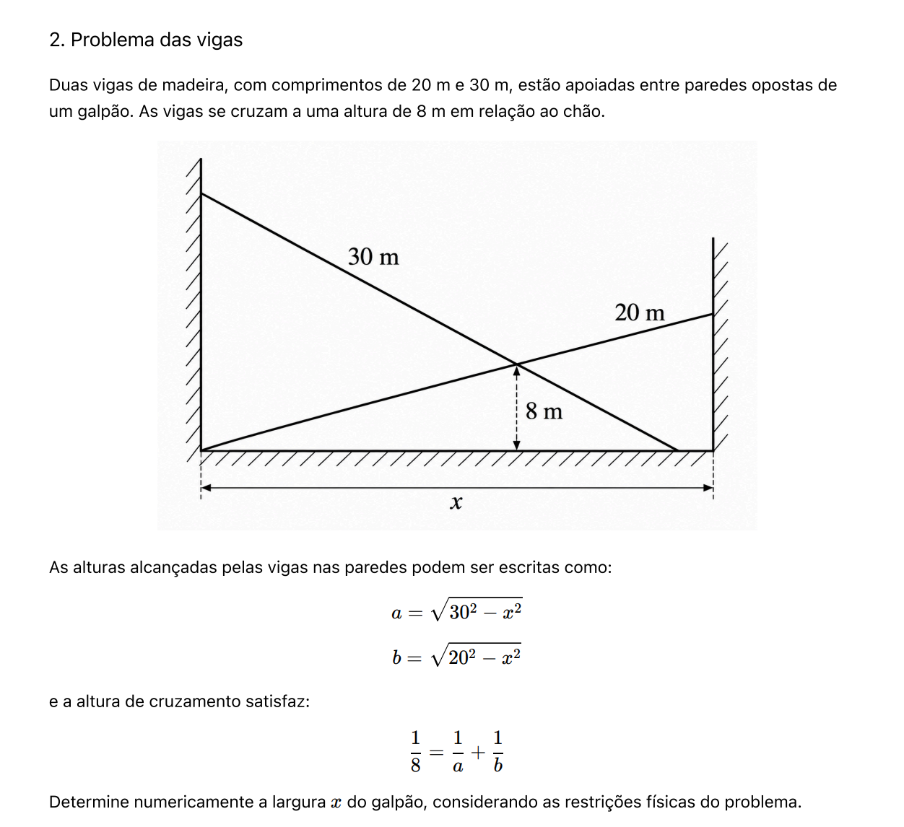

<h3 align="center">Métodos Numéricos para Determinação de Raízes</h3>

<div align="center">


</div>

---

<p align="center">
Projeto desenvolvido para a disciplina de Métodos Numéricos, comparando diferentes métodos de resolução de equações não lineares.
</p>

# 📝 Sumário

- [Sobre](#sobre)
- [Objetivo](#objetivo)
- [Integrantes](#integrantes)
- [Funcionalidades](#funcionalidades)
- [Estrutura do Projeto](#estrutura)
- [Tecnologias Utilizadas](#tecnologias-utilizadas)
- [Instalação e Execução](#como-executar)
- [Critério de Parada](#criterio)
- [Resultados](#resultados)

# 🧐 Sobre <a name="sobre"></a>

Este projeto foi desenvolvido como atividade avaliativa da disciplina de Métodos Numéricos. O objetivo é aplicar na prática os conceitos estudados em sala de aula, como métodos iterativos de resolução de equações e análise de convergência.

**Problema das Vigas:** duas vigas de madeira, de 30 m e 20 m, estão apoiadas entre paredes opostas de um galpão e se cruzam a 8 m do chão. Queremos determinar a largura `x` do galpão.



Com a = √(30² − x²) e b = √(20² − x²), a condição 1/8 = 1/a + 1/b leva a:

**f(x) = 1/√(900 − x²) + 1/√(400 − x²) − 1/8 = 0**, com a restrição física **0 < x < 20**, já que a viga de 20 m precisa alcançar a parede.

# 🎯 Objetivo <a name="objetivo"></a>

Implementar e comparar os métodos da **Bisseção**, **Posição Falsa**, **Iterativo Linear (Ponto Fixo)**, **Secantes** e **Newton-Raphson**, avaliando o número de iterações e a velocidade de convergência de cada um até a raiz (x ≈ 16,2121 m).

# 👥 Integrantes <a name="integrantes"></a>

- Darwin Gabriel
- Nelson Spinelli
- Lucas Ennes
- João Luis
- Rafael do Vale
- Rodrigo Correia

# ⚙️ Funcionalidades <a name="funcionalidades"></a>

- Pacote Python instalável via `pip` com os 5 métodos implementados pelo grupo (sem funções prontas)
- Tabelas de iteração para cada método
- Gráficos de convergência para cada método
- Comparação entre os métodos pelo número de iterações

# 📁 Estrutura do Projeto <a name="estrutura"></a>

```
├── pyproject.toml              # configuração do pacote
├── problema_vigas.ipynb        # notebook que importa o pacote e resolve o problema
├── aa.png
└── src/metodos_raizes/
    ├── __init__.py
    ├── metodos.py              # bisseção, posição falsa, ponto fixo, secante, Newton-Raphson
    └── problema.py             # f(x), f'(x) e g(x) do problema das vigas
```

# 🛠️ Tecnologias Utilizadas <a name="tecnologias-utilizadas"></a>

- Python 3
- Jupyter Notebook
- pandas
- matplotlib
- Git e GitHub

# ▶️ Instalação e Execução <a name="como-executar"></a>

### Pré-requisitos

- Python 3.9 ou superior
- pip

### Passo a passo

1. Clone o repositório:

```bash
git clone https://github.com/DarwinGAZ/Metodos-numericos.git
```

2. Acesse a pasta do projeto:

```bash
cd Metodos-numericos
```

3. Instale o pacote junto com as dependências do notebook:

```bash
pip install -e ".[notebook]"
```

4. Rode o notebook:

```bash
jupyter notebook problema_vigas.ipynb
```

### Usando o pacote em outro código

```python
from metodos_raizes import f, df, bissecao, newton_raphson

raiz, historico = newton_raphson(f, df, x0=15, tol=1e-6)
print(raiz)  # 16.2121...
```

Cada método retorna a raiz encontrada e o histórico das iterações.

# 🛑 Critério de Parada <a name="criterio"></a>

- **Critério:** |x<sub>k+1</sub> − x<sub>k</sub>| < 10⁻⁶ (nos métodos de intervalo, (b − a)/2 < 10⁻⁶), com limite de 100 iterações.
- **Justificativa:** como x é medido em metros, 10⁻⁶ corresponde a um micrômetro, precisão muito maior do que qualquer medida real do galpão exige. Esse valor também fica bem acima do erro de arredondamento do `float`, o que garante uma parada estável. O limite de iterações impede laços infinitos caso algum método não convirja.

# 📊 Resultados <a name="resultados"></a>

| Método | Chute inicial | Iterações | Raiz (m) |
|---|---|---|---|
| Bisseção | [10, 18] | 23 | 16,212126 |
| Posição Falsa | [10, 18] | 17 | 16,212126 |
| Ponto Fixo | x₀ = 15 | 8 | 16,212126 |
| Secantes | x₀ = 15, x₁ = 17 | 6 | 16,212126 |
| Newton-Raphson | x₀ = 15 | 5 | 16,212126 |

Newton-Raphson e Secantes convergem mais rápido, porque têm ordem de convergência 2 e ≈ 1,6. O Ponto Fixo converge de forma linear. A Bisseção é a mais lenta, mas sempre converge. A Posição Falsa fica no meio: a curvatura de f mantém um dos extremos do intervalo fixo.

**Largura do galpão: x ≈ 16,21 m**
